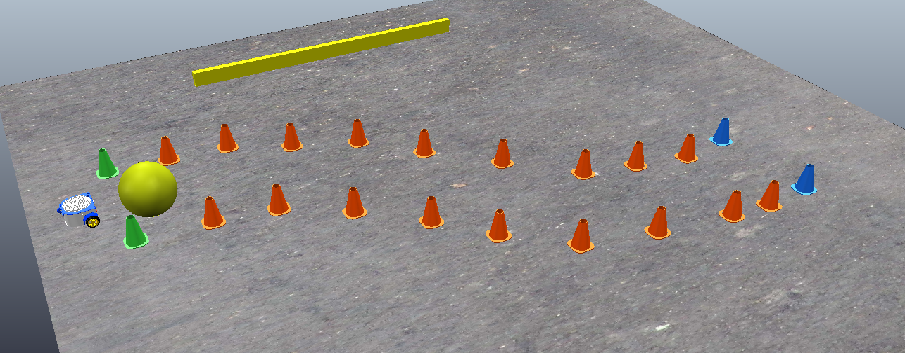

## Fossbot Simulator

### Installation 
1) Download the FossBot Simulator for your system ```https://github.com/chronis10/fossbot_simulator/releases/```
2) Downolad the Python 3.7 and higher
3) Install libraries 
```pip install pygame```
``` pip install pyyaml```
4) Install the Fossbot library ```pip install -U git+https://github.com/chronis10/fossbot_source.git --install-option="--platform=sim" ```
5) Install the Coppelia Simulator (EDU or Player) ```https://www.coppeliarobotics.com/downloads```


### Usage

1) Start the Coppelia Simulator
2) Load a scene from ```FossBot.Blockly.Windows_v0.1/Coppelia_Scenes`` directory and start the simulation using the play button from top
3) Start the ```FossBot Blockly.exe```
4) Enjoy!
